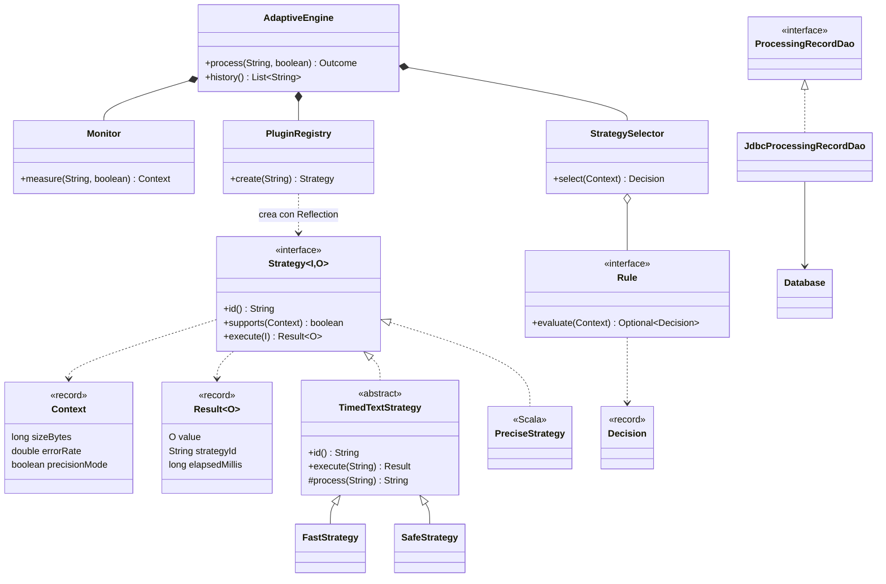

# Diagrama de clases

```mermaid
classDiagram
class Strategy~I,O~ {
  <<interface>>
  +id() String
  +supports(Context) boolean
  +execute(I) Result~O~
}
class Context {
  <<record>>
  long sizeBytes
  double errorRate
  boolean precisionMode
}
class Result~O~ {
  <<record>>
  O value
  String strategyId
  long elapsedMillis
}
class TimedTextStrategy {
  <<abstract>>
  +id() String
  +execute(String) Result
  #process(String) String
}
class FastStrategy
class SafeStrategy
class PreciseStrategy {
  <<Scala>>
}
class Monitor {
  +measure(String, boolean) Context
}
class Rule {
  <<interface>>
  +evaluate(Context) Optional~Decision~
}
class Decision {
  <<record>>
}
class StrategySelector {
  +select(Context) Decision
}
class PluginRegistry {
  +create(String) Strategy
}
class AdaptiveEngine {
  +process(String, boolean) Outcome
  +history() List~String~
}
class ProcessingRecordDao {
  <<interface>>
}
class JdbcProcessingRecordDao
class Database

Strategy <|.. TimedTextStrategy
Strategy <|.. PreciseStrategy
TimedTextStrategy <|-- FastStrategy
TimedTextStrategy <|-- SafeStrategy
AdaptiveEngine *-- Monitor
AdaptiveEngine *-- StrategySelector
AdaptiveEngine *-- PluginRegistry
StrategySelector o-- Rule
Rule ..> Decision
PluginRegistry ..> Strategy : crea con Reflection
Strategy ..> Context
Strategy ..> Result
ProcessingRecordDao <|.. JdbcProcessingRecordDao
JdbcProcessingRecordDao --> Database
```
